# Happy Hounds

## My Portfolio 1 Project

### By Bradley Hammond

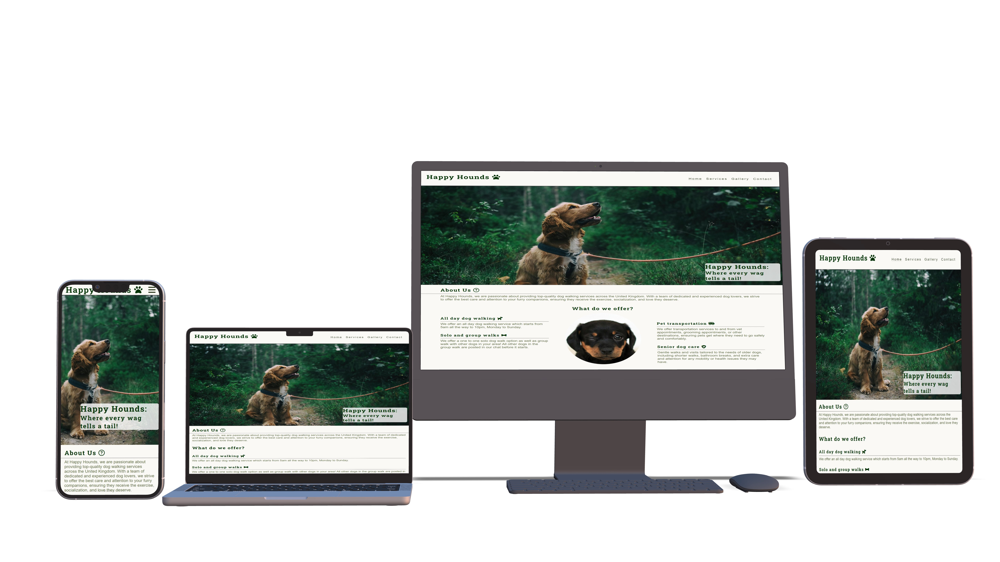

## About Happy Hounds

Happy Hounds is a website dedicated to dog walking. It offers users a simple process of viewing what the services on offer as well as being able to easily get in touch to use the services. The site is designed to be functional on all devices.

- ## User Stories

  - ### First Time User Gols

    1. As a first time user, I want to have access to a website which conveys its purpose quickly and is quick and easy to naviagte through.

    - I know this I am done when i enter the website and can see its purpose and navigate with ease.

    2. As a first time user, I want to be able to learn about the services offered such as types of walks, the times of walks and other services offered if applicable.

    - I know I am done when I enter the website and can easily see all information on the services offered.

    3. As a first time user, I want to be able to get in touch with Happy Hounds easily with no hindrance.

    - I know I am done when I have entered my contact information and Happy Hounds have contacted me.

    4. As a first time user, I want to be able to see useful videos regarding dog walking to better help my understanding.

    - I know I am done once I have viewed the useful videos.

    5. As a first time user, I want to know about any recommended dog walking products which can help me and my furry friend.

    - I know I am done when I have viewed / or purchased the recommended products.

    6. As a first time user, I want to be able to look at the gallery page and see all the happy dogs being walked.

    - I know I am done when I have viewed the gallery page.

  - ### Returning Visitor Goals

    1. As a returning user, I want to check the images page to see if my dog has been featured.

    - I know I am done when i view the gallery page and can see my dog.

    2. As a returning user, I want to check the check the updated useful videos.

    - I know I am done when I watch the updated useful videos.

    3. As a returning user, I want to be able to see the updated recommended products.

    - I know I am done when I view / or purchase the updated recommended products.

## Wireframes

The images below are of the wireframes I made to mock up how I wanted my website to look. I did 2 lots of mock ups, one for desktop and one for mobile. To complete my mock ups I used [WireFrame.cc](https://wireframe.cc/pro/).

### Mobile

#### Homepage

This is my homepage mock-up on mobile, this stayed true to the final product with a few styling changes. 

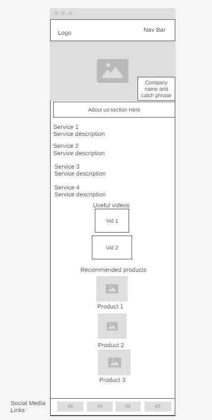

#### Gallery

This is my gallery page mock-up on mobile, this stayed true to the final product. 

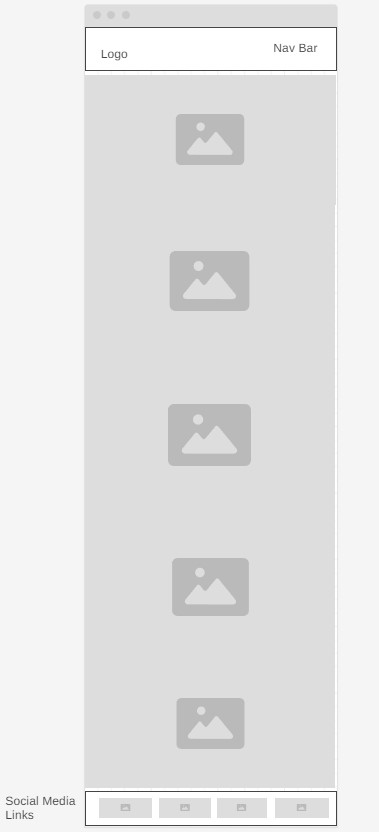

#### Contact

This is my contact page mock-up on mobile, this was a good reference but I opted for an animated background and a more circular border on the form section. 

### Desktop

#### Homepage

This is my homepage mock-up on desktop, this stayed true to the final product with a few styling changes such as more circular borders. 

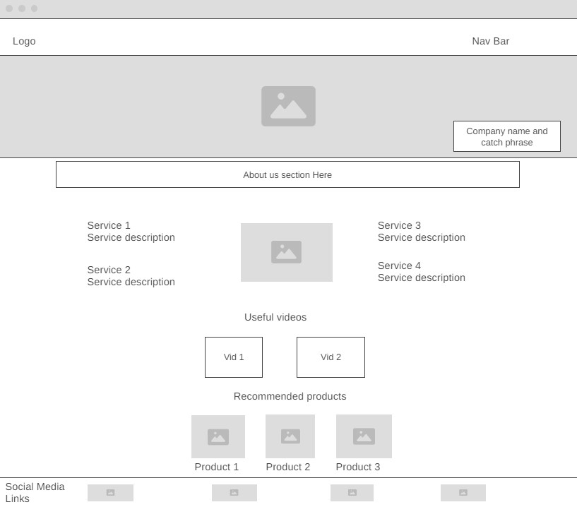

#### Gallery

This is my gallery page mock-up on desktop, in the final product I opted for a different layout of the images and inlcuded a color gradient background. 

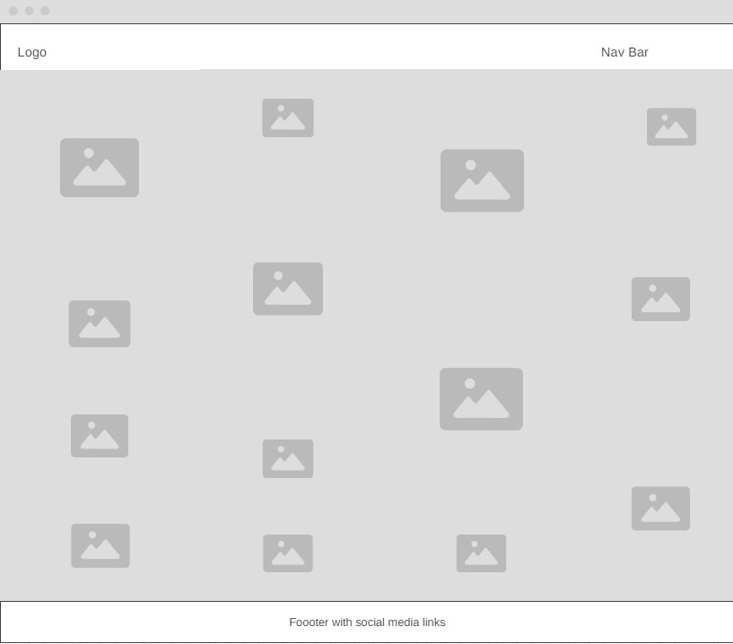

#### Contact

This is my contact page mock-up on desktop, this was a good reference but I opted for an animated background and a more circular border on the form section. 

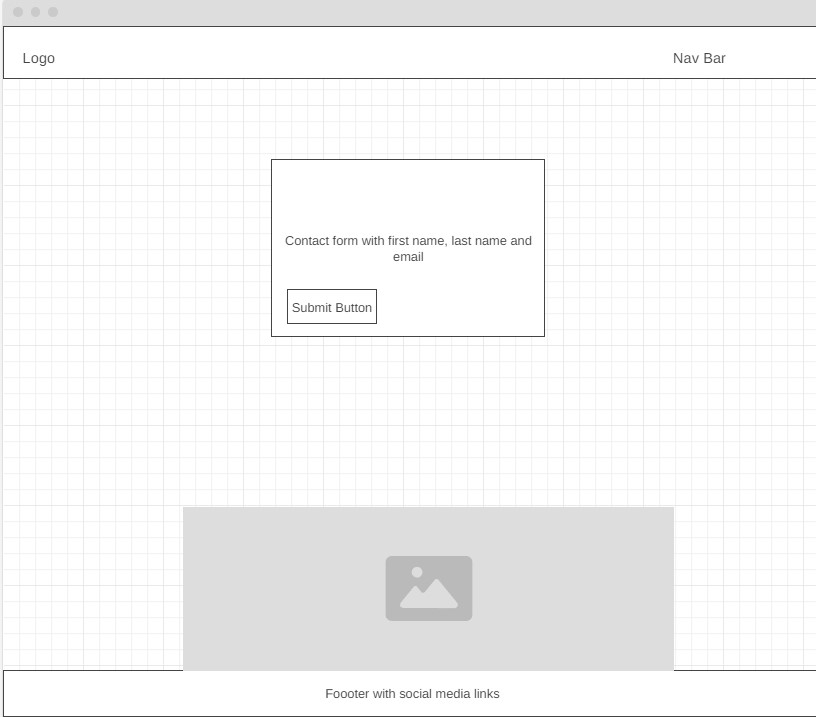

## Features

### Homepage

- The homepage shows a hero image of a dog with the company name at the bottom right.
- It has an about us section which clearly explains the purpose of the site.
- It has a services section which shows and explains the services on offer.
- It has 2 useful vidoes which explain the importance of dog walking.
- It has 3 recommended products to use when dog walking. 

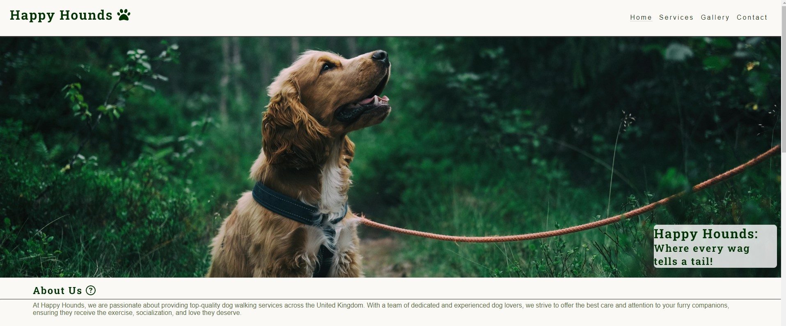
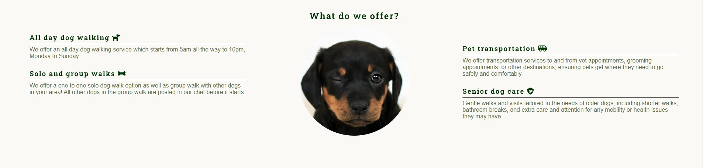
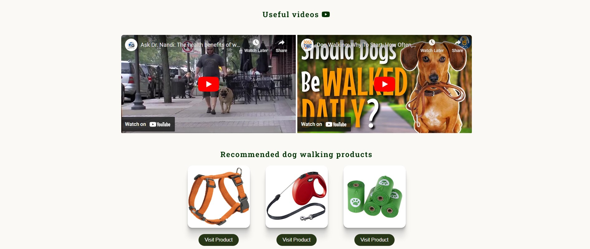
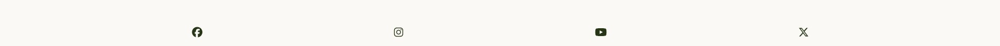

- The nav bar highlits which page you are on and which page you hover over.
- The services section has media queries so that on smaller screens the image of the dog does not appear.
- The youtube videos are fully controllable.
- The links to the products open in a new tab.
- The social media links open in a new tab and show when you are hovering over them.

### Gallery

- The gallery page has a total of 16 images on display.
- The images are shown in sets of 4.
- The background is a color gradient of the same color themse used throughout the webpage.
- All images have accurate alt text. 

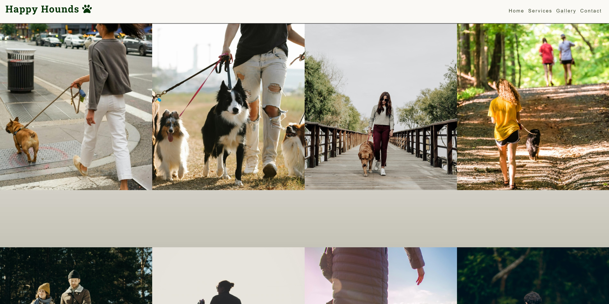

### Contact Page

- The contact page has a form section which includes a name and email fields as well as a submit button.
- The page has an animated background which uses the same color themse as the rest of the website. 

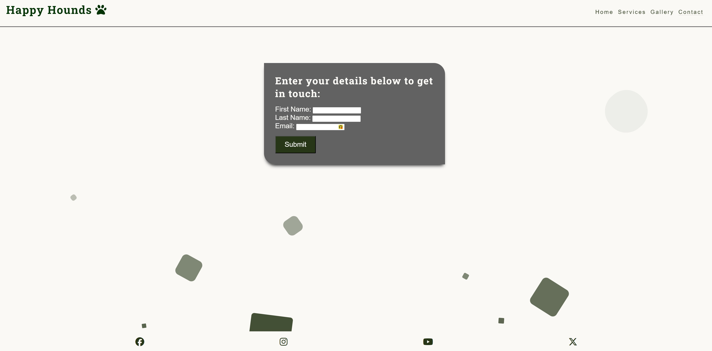

## Recources Used

- The code used to create this website was primarily HTML and CSS. Jave Script was used the the logo images.
- For images, I used [Pexels](https://www.pexels.com/).
- For optimizing the images, I used [Image Optimizer](http://www.imageoptimizer.net/Pages/Home.aspx).
- For the icons, I used [Font Awesome](https://fontawesome.com/).
- For the fonts, I used [Google Fonts](https://fonts.google.com/).
