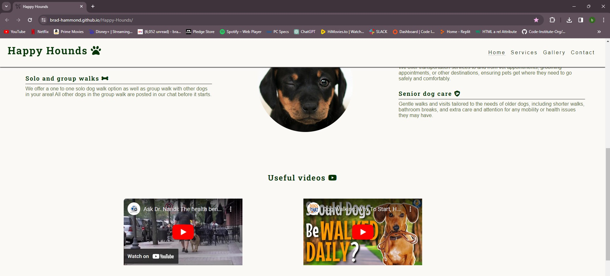
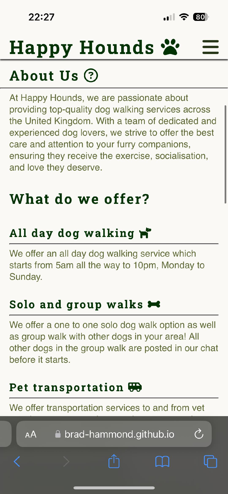

# Happy Hounds

## My Portfolio 1 Project

### By Bradley Hammond

### [View Live Project Here](https://brad-hammond.github.io/Happy-Hounds/)


## About Happy Hounds

Happy Hounds is a website dedicated to dog walking. It offers users a simple process of viewing what the services on offer as well as being able to easily get in touch to use the services. The site is designed to be functional on all devices.

- ## User Stories

  - ### First Time User Goals

    1. As a first time user, I want to have access to a website which conveys its purpose quickly and is quick and easy to naviagte through.

    - I know I am done when i enter the website and can see its purpose and navigate with ease.

    2. As a first time user, I want to be able to learn about the services offered such as types of walks, the times of walks and other services offered if applicable.

    - I know I am done when I enter the website and can easily see all information on the services offered.

    3. As a first time user, I want to be able to get in touch with Happy Hounds easily with no hindrance.

    - I know I am done when I have entered my contact information and Happy Hounds have contacted me.

    4. As a first time user, I want to be able to see useful videos regarding dog walking to better help my understanding.

    - I know I am done once I have viewed the useful videos.

    5. As a first time user, I want to know about any recommended dog walking products which can help me and my furry friend.

    - I know I am done when I have viewed / or purchased the recommended products.

    6. As a first time user, I want to be able to look at the gallery page and see all the happy dogs being walked.

    - I know I am done when I have viewed the gallery page.

  - ### Returning Visitor Goals

    1. As a returning user, I want to check the images page to see if my dog has been featured.

    - I know I am done when i view the gallery page and can see my dog.

    2. As a returning user, I want to check the check the updated useful videos.

    - I know I am done when I watch the updated useful videos.

    3. As a returning user, I want to be able to see the updated recommended products.

    - I know I am done when I view / or purchase the updated recommended products.

## Wireframes

The images below are of the wireframes I made to mock up how I wanted my website to look. I did 2 lots of mockups, one for desktop and one for mobile. To complete my mockups I used [WireFrame.cc](https://wireframe.cc/pro/).

### Mobile

#### Homepage

This is my homepage mock-up on mobile, this stayed true to the final product with a few styling changes.<br>


#### Gallery

This is my gallery page mock-up on mobile, this stayed true to the final product.<br>


#### Contact

This is my contact page mock-up on mobile, this was a good reference but I opted for an animated background and a more circular border on the form section.<br>


### Desktop

#### Homepage

This is my homepage mock-up on desktop, this stayed true to the final product with a few styling changes such as more circular borders.<br>


#### Gallery

This is my gallery page mock-up on desktop, in the final product I opted for a different layout of the images and included a color gradient background.<br>


#### Contact

This is my contact page mock-up on desktop, this was a good reference but I opted for an animated background and a more circular border on the form section.<br>


## Features

### Homepage

- The homepage shows a hero image of a dog with the company name at the bottom right.
- It has an about us section which clearly explains the purpose of the site.
- It has a services section which shows and explains the services on offer.
- It has 2 useful vidoes which explain the importance of dog walking.
- It has 3 recommended products to use when dog walking.<br>


- The nav bar highlits which page you are on and which page you hover over.
- On smaller screens such as mobile, the nav bar has a toggle button.
- The services section has media queries so that on smaller screens the image of the dog does not appear.
- The youtube videos are fully controllable.
- The links to the products open in a new tab.
- The social media links open in a new tab and show when you are hovering over them.

### Gallery

- The gallery page has a total of 16 images on display.
- The images are shown in sets of 4.
- The background is a color gradient of the same color themse used throughout the webpage.
- All images have accurate alt text.<br>


### Contact Page

- The contact page has a form section which includes a name and email fields as well as a submit button.
- The page has an animated background which uses the same color theme as the rest of the website.<br>


## Languages Used

- [HTML5](https://en.wikipedia.org/wiki/HTML5)

- [CSS3](https://en.wikipedia.org/wiki/Cascading_Style_Sheets)

## Resources Used

- The code used to create this website was primarily HTML and CSS. JavaScript was used the the logo images.
- For images, I used [Pexels](https://www.pexels.com/).
- For optimizing the images, I used [Image Optimizer](http://www.imageoptimizer.net/Pages/Home.aspx).
- For the icons, I used [Font Awesome](https://fontawesome.com/).
- For the fonts, I used [Google Fonts](https://fonts.google.com/).

## Testing

As well as using both W3C Markup Validator and W3C Validator Services to ensure there were no errors in both my HTML and CSS code, I also used chrome dev tools throughout the development process. This proved very useful when trying to debug styling issues and also find any issues with different viewports such as mobile.

### Validator Testing

#### HTML

- Homepage: No errors were returned when passing through the official W3C validator
  [https://validator.w3.org/nu/?doc=https%3A%2F%2Fbrad-hammond.github.io%2FHappy-Hounds%2Findex.html](https://validator.w3.org/nu/?doc=https%3A%2F%2Fbrad-hammond.github.io%2FHappy-Hounds%2Findex.html)

- Gallery Page: No errors were returned when passing through the official W3C validator
  [https://validator.w3.org/nu/?doc=https%3A%2F%2Fbrad-hammond.github.io%2FHappy-Hounds%2Fgallery.html](https://validator.w3.org/nu/?doc=https%3A%2F%2Fbrad-hammond.github.io%2FHappy-Hounds%2Fgallery.html)

- Contact Page: No errors were returned when passing through the official W3C validator
  [https://validator.w3.org/nu/?doc=https%3A%2F%2Fbrad-hammond.github.io%2FHappy-Hounds%2Fcontact.html](https://validator.w3.org/nu/?doc=https%3A%2F%2Fbrad-hammond.github.io%2FHappy-Hounds%2Fcontact.html)

#### CSS

- No errors were found when passing through the official Jigsaw validator
  [http://jigsaw.w3.org/css-validator/validator?lang=en&profile=css3svg&uri=https%3A%2F%2Fbrad-hammond.github.io%2FHappy-Hounds%2F&usermedium=all&vextwarning=&warning=1](http://jigsaw.w3.org/css-validator/validator?lang=en&profile=css3svg&uri=https%3A%2F%2Fbrad-hammond.github.io%2FHappy-Hounds%2F&usermedium=all&vextwarning=&warning=1)

## Lighthouse Reports

- Lighthouse Report for Desktop:
  

- Lighthouse report for mobile:
  

## User Story Testing

### First Time User Goals

1.  As a first time user, I want to have access to a website which conveys its purpose quickly and is quick and easy to naviagte through.

- I know I am done when i enter the website and can see its purpose and navigate with ease.

**Evidence:** When entering the site, users are quickly greeted with with the homepage which displayes the main purpose of the site as well as being easy to navigate


2.  As a first time user, I want to be able to learn about the services offered such as types of walks, the times of walks and other services offered if applicable.

- I know I am done when I enter the website and can easily see all information on the services offered.

**Evidence:** When entering the site, users can see all services offered quickly and easy. If on another page such as the gallery page, there is a link to the services on the nav bar


3. As a first time user, I want to be able to get in touch with Happy Hounds easily with no hindrance.

- I know I am done when I have entered my contact information and Happy Hounds have contacted me.

**Evidence:** When entering the site, users can press the nav bar link to the contact section. This brings them to the contact form, which they can fill out with their contact information for someone to get in touch


4. As a first time user, I want to be able to see useful videos regarding dog walking to better help my understanding.

- I know I am done once I have viewed the useful videos.

**Evidence:** When entering the site, users can scroll down on the homepage to view all useful videos. There is a helpful heading which also indicates where the videos are located and both videos are fully controllable


5. As a first time user, I want to know about any recommended dog walking products which can help me and my furry friend.

- I know I am done when I have viewed / or purchased the recommended products.

**Evidence:** When a user enters the site, they can scroll down on the homepage to view all recommended products. All products are linked to their companies websites and open in a new tab


6. As a first time user, I want to be able to look at the gallery page and see all the happy dogs being walked.

- I know I am done when I have viewed the gallery page.

**Evidence:** When entering the site, users can use the nav bar to navigate to the gallery page. Here, all photos are on display for the users


### Returning User Goals

1. As a returning user, I want to check the images page to see if my dog has been featured.

- I know I am done when i view the gallery page and can see my dog.

**Evidence:** When entering the site, a user can navigate to the gallery page using the nav bar. Once here, they can look to see if their dog has been featured.

2. As a returning user, I want to check the check the updated useful videos.

- I know I am done when I watch the updated useful videos.

**Evidence:** When entering the site, a user can scroll down on the homepage to the useful videos section. Here, they can view all the new videos uploaded.

3. As a returning user, I want to be able to see the updated recommended products.

- I know I am done when I view / or purchase the updated recommended products.

**Evidence:** When entering the site, users can scroll down on the homepage to the recommended products section. Here, they can check to see what the updated products are.

## Further Testing

- I manually tested my website on different viewports using Chrome DevTools and using the responsive tool bar to change the view of the website.
- All links on the webpage have been tested and are working correctly with no errors.
- All links to other webpages open in a new browser.
- I used my devices as well as friends devices to help stress-test and bug-test my website.

### Images of Happy Hounds on different devices and search engines

#### Desktop

| Safari 17.3.1                                                       | Firefox 123.0.1                                                      | Chrome 122.0.6261.112                                              |
| ------------------------------------------------------------------- | -------------------------------------------------------------------- | ------------------------------------------------------------------ |
|         |         |         |
|     |     |     |
|     |     |     |
|     |     |     |
|      |      |      |
|  |  |  |
|  |  |  |
|  |  |  |
|      |      |      |

#### Mobile / Tablet

| Iphone - Safari 17.3.1                                          | Ipad - Safari 17.3.1                                        | Android - 14.0                                                    |
| --------------------------------------------------------------- | ----------------------------------------------------------- | ----------------------------------------------------------------- |
|      |      |      |
|  |  |  |
|  |  |  |
|  |  |  |
|  |  |  |
|        |       |        |
|    |   |    |
|    |   |    |
|        |        |        |

## Bugs

### Fixed Bugs

#### Bug 1

- Both iframe youtube videos were not playing, it popped up with a playback error when I pressed the play button. Please see below code which fixed this error:

#### Original Code:

```html
<iframe
  width="560"
  height="315"
  src="https://www.youtube.com/embed/a8ze37bhmGw?si=IESpBzkke8z6ZET_"
  frameborder="0"
  allowfullscreen
></iframe>
```

#### Correct Code:

```html
<iframe
  width="560"
  height="315"
  src="https://www.youtube.com/embed/a8ze37bhmGw?si=IESpBzkke8z6ZET_"
  title="YouTube video player"
  allow="accelerometer; autoplay; clipboard-write; encrypted-media; gyroscope; picture-in-picture; web-share"
  allowfullscreen
></iframe>
```

#### Bug 2

- Both youtube videos were not clickable, this was due to the height of the services section. Please see below code which fixed this:

#### Original Code:

```css
#services {
  height: 750px;
}
```

#### Correct Code:

```css
#services {
  height: 400px;
}
```

#### Bug 3

- A container was causing the screen to have a horizontal scroll bar, to fix this I applied the below code:

```css
html,
body {
  max-width: 100%;
  overflow-x: hidden;
}
```

## Deployment

### Github Pages

### Cloning & Forking

#### Fork

- On [GitHub.com](https://github.com/?ef_id=_k_CjwKCAiA0bWvBhBjEiwAtEsoW01GluBZUzv5xTH0n3HKkz5KUWYDsQcku6UhfQ5ZBN16SKrnYN6F9BoC1bsQAvD_BwE_k_&OCID=AIDcmm153qff2f_SEM__k_CjwKCAiA0bWvBhBjEiwAtEsoW01GluBZUzv5xTH0n3HKkz5KUWYDsQcku6UhfQ5ZBN16SKrnYN6F9BoC1bsQAvD_BwE_k_&gad_source=1&gclid=CjwKCAiA0bWvBhBjEiwAtEsoW01GluBZUzv5xTH0n3HKkz5KUWYDsQcku6UhfQ5ZBN16SKrnYN6F9BoC1bsQAvD_BwE), in the search bar, search for [Brad-Hammond/Happy-Hounds](https://github.com/Brad-Hammond/Happy-Hounds) repository.
- At the top right of the screen, click fork.
- Typically, when you fork a repository, it retains the same name as the original repository. However, you have the option to rename the fork for better distinction.
- Add a description to your newly created fork, if desired.
- Click create fork.

#### Clone

- At the top of the repository above the files, press Code.
- Copy the URL for the repository.
- Open the terminal and change the directory to the location where you want the cloned directory.
- Type git clone, and then paste the URL.
- Press enter, and you're done!

### Local Deployment

- Sign up to [Gitpod](https://www.gitpod.io/).
- Download the Gitpod browser extension.
- Once on Github, find your way to the [Brad-Hammond/Happy-Hounds](https://github.com/Brad-Hammond/Happy-Hounds) repository.
- Above the list of files click the button that says 'Gitpod'.

### Remote Deployment

The website has been launched on GitHub Pages. If you've made a copy of the repository by forking or cloning it, here are the steps to deploy it:

- On GitHub.com, navigate to your repository.
- Find your way to the settings tab.
- Click on the tab called 'pages' on the left hand side.
- From the source drop down list under the heading Build and deployment, select main.
- The page will then provide the link to the website.

---

## Credits

- For inspiration and ideas, credits to [CI Love Running](https://code-institute-org.github.io/love-running-2.0/index.html)
- For all images used, credits to [Pexels](https://www.pexels.com/)
- For the animated background, credits to [Devdevout](https://devdevout.com/css/css-animated-backgrounds)
- For both the videos, credits to [Youtube](https://www.youtube.com/)
- For the dog-harness, credits to [Hunter](https://www.hunterpetuk.co.uk/)
- For the dog-lead, credits to [Flexi-Leads](https://www.flexi-leads.co.uk/)
- For the dog waste bags, credit to [Zooplus](https://www.zooplus.co.uk/)
- For helping push me towards my goal, credit to my mentor Daniel
